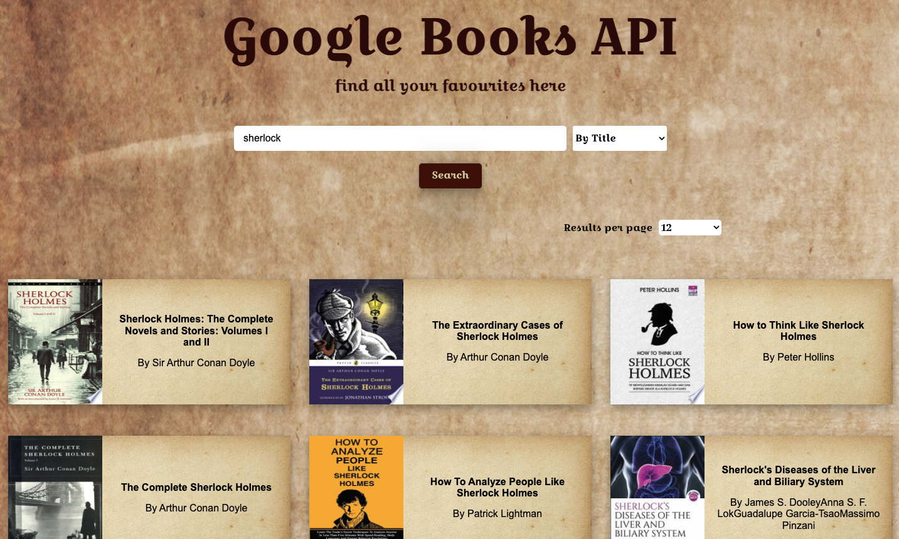
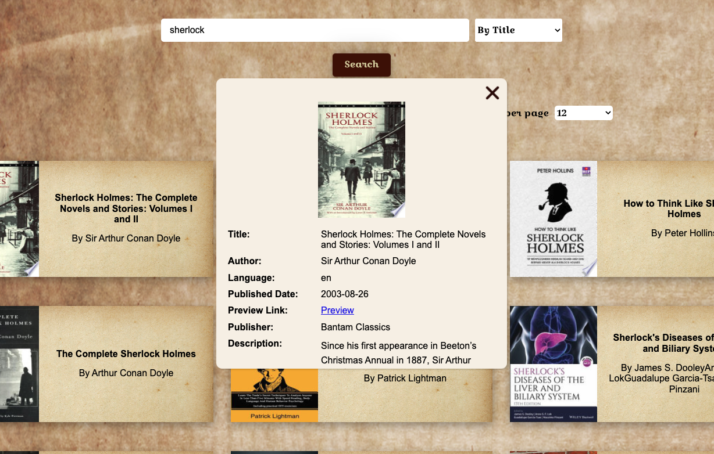
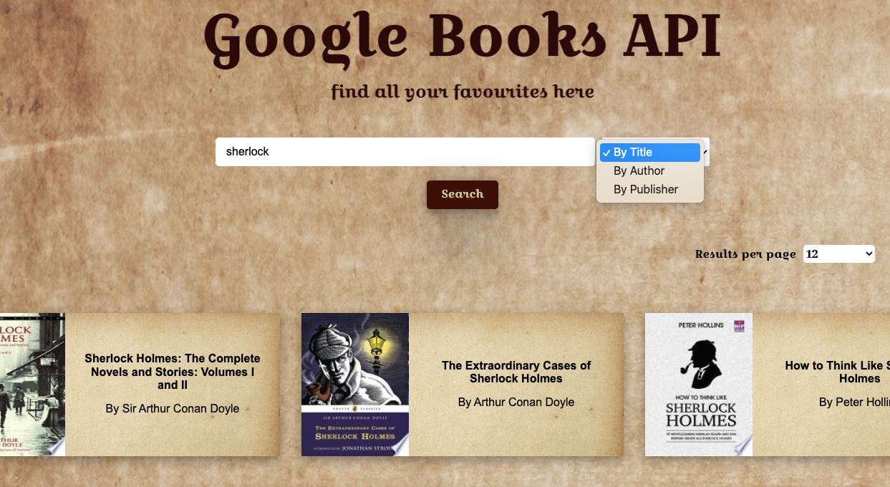
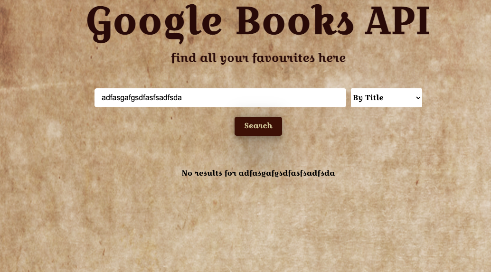
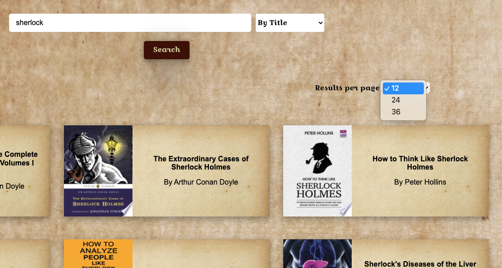
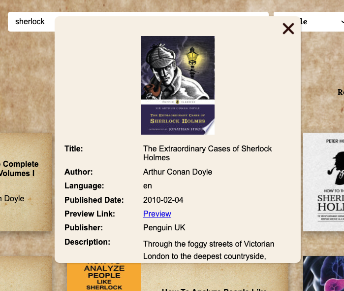
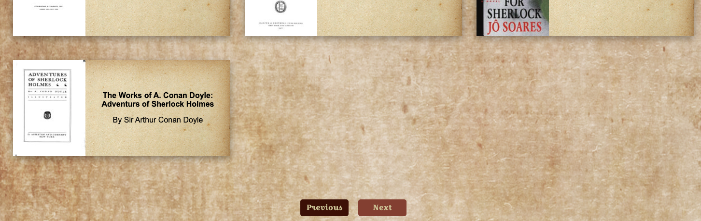

# Google Book API Search Engine

This is a Google Book API Search Engine for finding books

### 🚀 [Launch Live Project](https://gulama2008.github.io/google-books/)

## Table of Contents

- [Snippets](#snippets)
- [Purpose](#purpose-of-project)
- [Tech Stack](#tech-stack)
- [Requirements](#requirements)
    - [MVP](#mvp)
    - [Bonus](#bonus)
- [Features](#features)
- [Known Issues](#known-issues)
- [Future Goals](#future-goals)

## Snippets

Overview  

Book details 

## Purpose Of Project
This project will require you to use both DOM manipulation and Asynchronous programming. The aim is for the user to be able to search for a book inside the Google Books database and to be able to get more details about a certain title.

## Tech Stack

- React
- HTML
- CSS/SCSS
- JavaScript
- React Router DOM
- Google Books API

## Requirements

### MVP
Create a page that allows users to search for books
Page should include the following:

- Header section introducing the page
- Form containing a text input and a submit / search button

- A grid of books
  Instructions:

- When the submit button is clicked you need the request books from the Google books API using the input value as your query string
- The books that you receive should be rendered in the books grid.
- Each book in the grid should have an image, author, title and description
- The grid should be responsive on different screen sizes
- You should use async / await for your request code. You can choose how to handle the code in component

Styling (required):

This application should look good, take some time to pick a palette and plan out your design. You can use tools like Figma or wireframe pro to plan what your application is going to look like.
Styling must use BEM, and each block should have its own SCSS file Your palette should use variables

Application Design (required):

- Seperate request code from components
- functions should do 1 thing, and should be as pure and reusable as possible
  - Think about how you might "clean" the data
- Always use iterators over loops
- Always parametrize and abstract large pieces of duplicate code.
- Presentational components should be as dumb as possible
### Bonus  
- Give feedback to the user when no book results can be found for the query.
- When a user clicks a book in the grid, a modal should appear with more book information, think about release, publish date, country, languages, etc.

## Feature
This Google Book API Search Engine has the following features:
- The search bar and a select options of searching by title, by author or by publisher

- If no result found, it will show "No results for {search term}"

- With the search result, there is a select option of result shown per page, with options of 12, 24 or 36

- Each result is presented as a book card, with a front cover image of the book, the title and the author
- When click each book card, there is a modal shown more details of the book, including image, title, author, language, puslished date, preview link, publisher and description

- At the bottom of the page, there is a previous button and a next button. The previous button is disabled when on the first page, and is active from the second page. The next button is disabled on the last page, and is active on any previous pages

## Known Issues  
- Since the google book API itself has some limitations, the functionality of search by arthur and by publisher sometimes will still show the result of by title
- If the title and name of arthur is too long, the content on the search result card looks squeezed

## Future Goals

- Built better UI for showing books result

